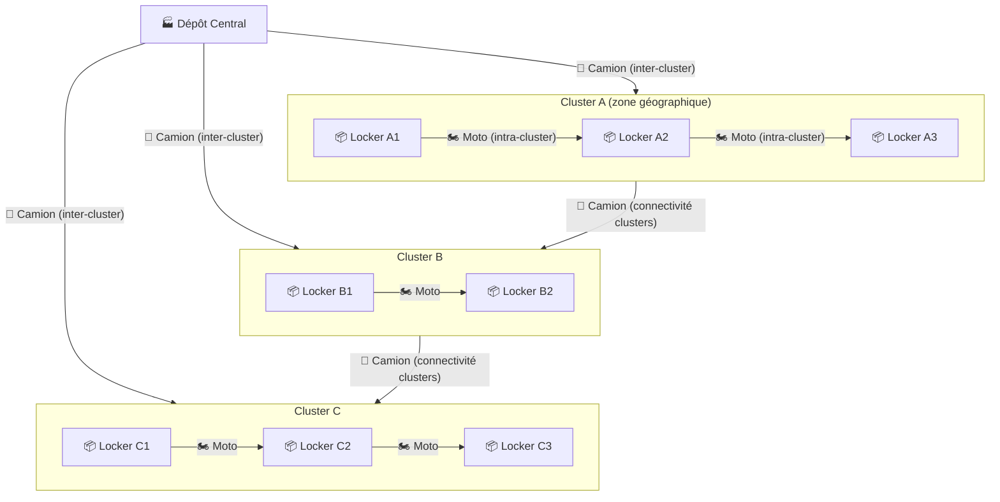
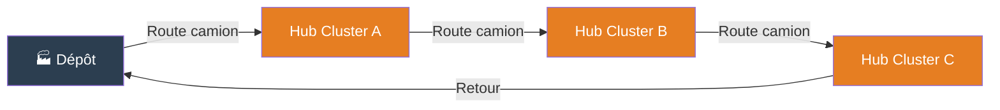
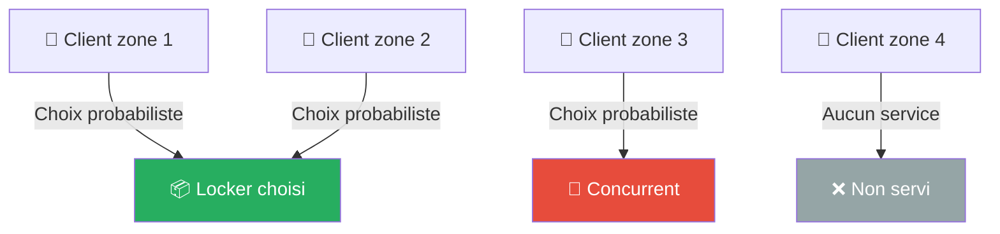
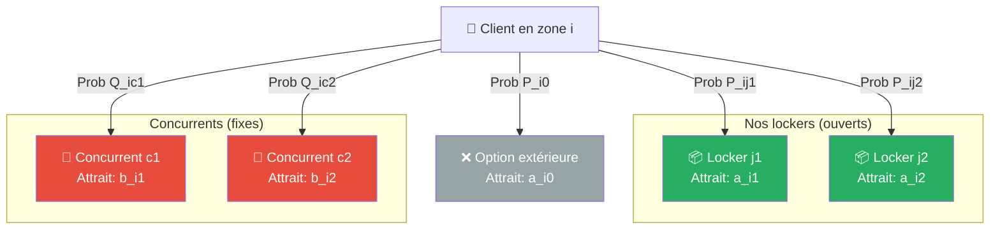
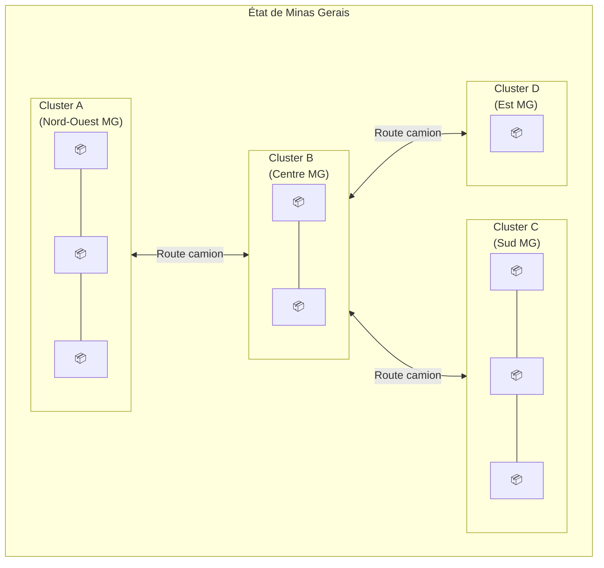
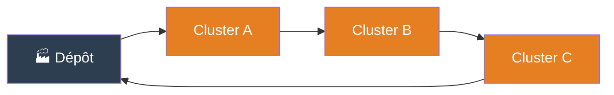
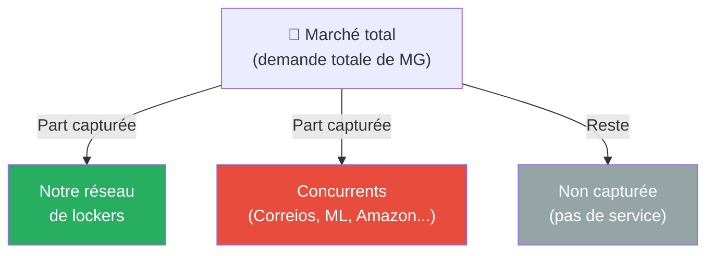
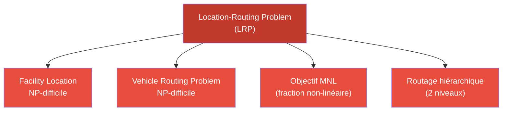

# Problème de Location-Routing pour les Lockers Intelligents — Minas Gerais

## 1. Vue d'ensemble

L'objectif est de **concevoir un réseau de lockers  stationnaires** dans les zones rurales et sous-desservies de Minas Gerais, afin de **maximiser la part de marché capturée** face à des concurrents existants (Correios, Mercado Livre, etc.).

Le problème mêle deux décisions interdépendantes :

- **Décision de localisation** : quels sites ouvrir comme lockers ?
- **Décision de routage** : comment acheminer les colis jusqu'aux lockers (camions inter-clusters, motos intra-cluster) ?

Le comportement des clients est modélisé par un **modèle de choix probabiliste (Multinomial Logit)** : chaque client choisit un locker avec une probabilité qui dépend de l'attractivité du locker et de sa distance.

---

## 2. Architecture générale du réseau



> **Lecture du schéma :** Les camions partent du dépôt et relient les clusters entre eux (niveau 1). Au sein de chaque cluster, des motos distribuent les colis aux lockers individuels (niveau 2). Les clients se rendent ensuite au locker de leur choix.

---

## 3. Les acteurs du système

### 3.1 Les camions 🚛



- **Rôle** : transport en gros volume entre le dépôt et les hubs de chaque cluster
- **Contraintes** : capacité de chargement, durée maximale de tournée, coût kilométrique
- **Décision** : quels clusters visiter et dans quel ordre (VRP niveau 1)

### 3.2 Les motos 🏍️


- **Rôle** : distribution fine à l'intérieur d'un cluster, entre le hub et chaque locker ouvert
- **Avantage** : accès aux zones difficiles, routes étroites, zones rurales
- **Contraintes** : capacité limitée (quelques colis), rayon d'action
- **Décision** : quels lockers visiter et dans quel ordre (VRP niveau 2)

### 3.3 Les clients 🧑‍🤝‍🧑



- **Rôle** : ils se déplacent d'eux-mêmes vers un locker (ou un concurrent)
- **Modèle** : leur choix est probabiliste — modélisé par le **Multinomial Logit (MNL)**
- **Facteurs** : distance au locker, attractivité du locker, attractivité des concurrents

---

## 4. Le modèle d'attraction des clients (MNL)

### Intuition

Chaque client dans une zone $i$ fait face à plusieurs alternatives :
- Les lockers ouverts par l'opérateur $\{j \in J : x_j = 1\}$
- Les lockers des concurrents $\{c \in C\}$
- L'option "ne pas utiliser de locker" (option extérieure)

Le client choisit l'option qui maximise son utilité perçue, avec une composante aléatoire.



### Attractivité décroissante avec la distance

L'attractivité d'un locker $j$ pour un client en zone $i$ décroît avec la distance $d_{ij}$ :

```
Attractivité
    │
  1 │ ●
    │    ●
    │        ●
    │            ●
  0 │                ●  ●  ●  ●  ● ─────────
    └──────────────────────────────────────── Distance d_ij
         proche            loin
```

Formule : $a_{ij} = e^{\,\alpha_j - \beta \cdot d_{ij}}$

- $\alpha_j$ : attractivité intrinsèque du locker $j$ (taille, équipements, réputation)
- $\beta$ : sensibilité des clients à la distance (paramètre à calibrer)
- Plus $\beta$ est grand, plus les clients sont "sensibles" à la distance

---

## 5. Structure en clusters géographiques

### Pourquoi des clusters ?

Dans les zones rurales de MG, les ~20 000 points de livraison ne peuvent pas être servis un par un par des camions. On **agrège les sites** en zones géographiques cohérentes (municípios, bassins de population, etc.) appelées **clusters**.



### Règles de connectivité des clusters

- Chaque cluster ouvert (possédant au moins un locker) **doit être relié** au réseau de distribution
- La connectivité est assurée par les routes de camions
- Les clusters forment un **graphe connexe** dans la solution finale
- Un cluster non connecté = ses lockers ne peuvent pas être réapprovisionnés = solution infaisable



> La tournée des camions forme un **cycle** passant par tous les clusters ouverts et revenant au dépôt (structure VRP/TSP au niveau cluster).

---

## 6. Les concurrents



- Les concurrents ont des **lockers/agences déjà en place** → leurs attractivités $b_{ic}$ sont **fixées** (données exogènes)
- Notre opérateur **ne contrôle pas** les décisions des concurrents
- L'objectif est de maximiser notre part du marché en choisissant stratégiquement où ouvrir nos lockers

---

## 7. Résumé des décisions du problème

| Décision | Type | Description |
|---|---|---|
| Ouvrir le locker $j$ ? | Binaire $x_j \in \{0,1\}$ | Localisation |
| Route des camions | Entier (arcs) | Routage niveau 1 (inter-cluster) |
| Route des motos | Entier (arcs) | Routage niveau 2 (intra-cluster) |
| Clusters connectés ? | Contrainte | Connectivité du réseau |

**Objectif :** Maximiser la part de marché capturée (MNL), sous contrainte de budget et de capacité des véhicules.

---

## 8. Difficulté du problème



Le LRP est **NP-difficile** en lui-même. L'ajout du MNL (objectif fractionnaire non-linéaire) et du routage à deux niveaux en font un problème très complexe. La stratégie de résolution repose sur :

1. **Linéarisation** du MNL (reformulation McCormick)
2. **Décomposition hiérarchique** (résoudre localisation puis routage, ou Benders)
3. **Instances réduites** pour validation, puis passage à l'échelle

---

*Document de référence — Stage UFMG 2026 — Bastien Jacquelin*
